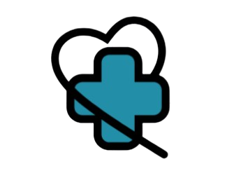

# Telehealth Collaboration Platform

### Overview
The Telehealth Collaboration Platform is a comprehensive solution designed to facilitate remote healthcare consultations, patient management, and data analytics. This platform aims to improve accessibility to healthcare professionals and streamline patient record management, enhancing overall efficiency in the healthcare system.

### Features
- **User Roles:** Supports multiple roles including patients, doctors, and nurses, each with their respective dashboards.
- **Appointment Scheduling:** Allows patients to schedule appointments with healthcare providers.
- **Video Consultations:** Secure video consultations between patients and healthcare professionals.
- **Patient Record Management:** Easy management of patient records, accessible to authorized users.
- **Multi-Factor Authentication (MFA):** Enhanced security for user sign-up and login processes.
- **Analytics and Reporting:** Provides insights and reports on various healthcare metrics.
- **AI-Powered Insights:** Uses machine learning to provide predictions and suggestions for better patient care.
- **Automated Summarization:** AI-generated summaries of patient records and consultation notes.
- **Natural Language Processing (NLP) for Records:** Enables automatic extraction of key details from medical reports.
- **Voice Recognition for Notes:** Doctors and nurses can dictate notes, which are transcribed into text.
- **Real-Time Notifications:** Alerts for upcoming appointments, new messages, and status updates.
- **Seamless Data Synchronization:** Ensures that updates in one section reflect across all relevant dashboards.

### Technology Stack
- **Frontend:** HTML, CSS, JavaScript (React)
- **Backend:** Python (Flask)
- **Database:** MySQL
- **AI & Machine Learning:** TensorFlow, OpenAI API
- **Deployment:** aiven
- **Version Control:** GitHub

### Installation

1. **Clone the Repository:**
   ```bash
   git clone https://github.com/your-username/Telehealth-Collaboration-Platform-MVP.git
   ```
   
2. **Navigate to the Project Directory:**
   ```bash
   cd Telehealth-Collaboration-Platform-MVP
   ```

3. **Set Up Virtual Environment:**
   ```bash
   python -m venv venv
   source venv/bin/activate   # On Windows use `venv\Scripts\activate`
   ```

4. **Install Dependencies:**
   ```bash
   pip install -r requirements.txt
   ```

5. **Run the Application:**
   ```bash
   flask run
   ```
   
### Project Structure

```plaintext
Telehealth-Collaboration-Platform-MVP/
│
├── assets/                 # Fonts, images, icons, etc.
├── back-end/               # Backend code (Python, Flask apps)
├── config/                 # Configuration files
├── docs/                   # Documentation
├── front-end/              # Frontend files (HTML, CSS, JavaScript)
│   ├── pages/              # Each page (home, login, dashboard, etc.)
│   ├── styles/             # CSS files for styling
│   └── scripts/            # JavaScript files for interactivity
└── README.md               # Project documentation (this file)
```

### Usage
1. **Sign Up Process:**
   - Navigate to the sign-up page.
   - Select user type (Patient, Doctor, or Nurse).
   - Fill in required details and complete MFA code.
   - Upon successful sign-up, the user is redirected to their specific dashboard.

2. **Login Process:**
   - Navigate to the login page.
   - Select user type and enter credentials.
   - Upon successful login, the user is redirected to their specific dashboard.

### Challenges
- **Technical:** Ensuring seamless integration of AI-powered features with existing workflows, and handling real-time data synchronization efficiently.
- **Non-Technical:** Managing user adoption, ensuring compliance with healthcare regulations, and maintaining a user-friendly experience.

### Progress
- **Current Status:** 8/10 - Core features are functional, with ongoing refinements.
- **Completed:** User authentication, appointment scheduling, video consultations, patient record management.
- **Pending:** Advanced AI integrations, final UI/UX refinements, performance optimizations.

### Contributing
If you are interested in contributing to this project, please fork the repository and submit a pull request with your changes.

### License
This project is licensed under the MIT License.

### Contact
For any questions or feedback, please reach out to [webusineservices@gmail.com].

---